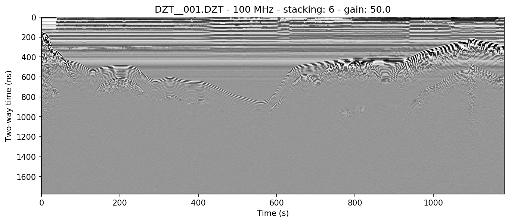
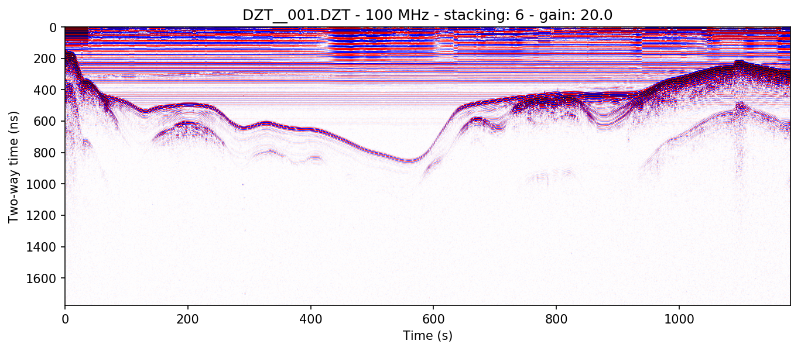
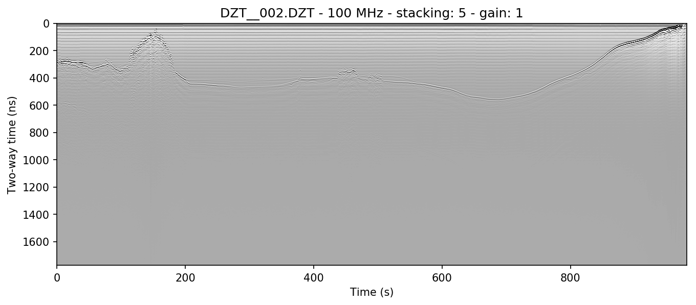
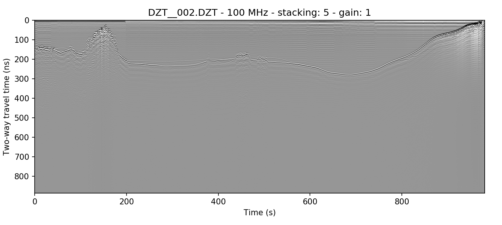

# readgssi v0.0.6-beta5
*Copyleft 🄯 2017-2018*


`readgssi` is a tool intended for use as an open-source translator and preprocessing module for subsurface data collected with GSSI ground-penetrating georadar (GPR) devices. It has the capability to read DZT and DZG files with the same pre-extension name and plot the data contained in those files. `readgssi` is also currently able to translate most DZT files to CSV and will be able to translate to multiple other output formats including HDF5 and SEG-Y, though not all formats are available yet (see [future](#future)). Original Matlab code developed by Gabe Lewis, Dartmouth College Department of Earth Sciences. Python translation written with permission by Ian Nesbitt, University of Maine School of Earth and Climate Sciences.

Questions, feature requests, and bugs: **ian * nesbitt at gmail * com**

## changes since 0.0.5
- fixed a bug that caused both plots of dual-channel radar files to be written out to one file
- fixed a bug that caused manually-created output file names to be ignored when plotting
- added basic background removal and dewow capability ([#5](https://github.com/iannesbitt/readgssi/pull/5) from [@fxsimon](https://github.com/fxsimon))
- added support for the D50800/D50300 antenna
  - added plotting support for dual-channel radar devices
  - merged [#3](https://github.com/iannesbitt/readgssi/pull/3) from [@fxsimon](https://github.com/fxsimon) which fixed a bug that caused multi-channel file traces to be read in a 121212 sequence instead of 111222
- updated the workings of the plotting algorithm's colormap
- changed the way files are saved (bug in 0.0.5 mangled some filenames)
- added the ability to specify colormap and whether to draw a colorbar and a histogram
- added an automatic figsize option (leaves figsize up to Matplotlib)
- added ability to apply gain
- fixed bug that caused gain to be applied incorrectly
- script now tries to automatically calculate timezero using (nsamp\*range)/position
#### known bugs:
- translation to anything but csv is broken (hope to have time to at least fix HDF5 output soon)
  - csv translation does not work for dual-channel radar devices (exports to file but channels are merged end-to-end)
- color bar shows up too large on some plots (no known fix yet)
- dewow doesn't work on all files

## usage
```
usage:
python readgssi.py -i input.DZT [OPTIONS]

optional flags:
    COMMAND     |      ARGUMENT       |       FUNCTIONALITY
-v, --verbose   |                     |  verbosity
-o, --output    | file:  /dir/f.ext   |  specify an output file
-f, --format    | string, eg. "csv"   |  specify output format (csv is the only working format currently)
-p, --plot      | +integer or "auto"  |  plot will be x inches high (dpi=150), or "auto". default: 10
-n, --noshow    |                     |  suppress matplotlib popup window and simply save a figure (useful for multiple file processing)
-c, --colormap  | string, eg. "Greys" |  specify the colormap ([https://matplotlib.org/users/colormaps.html#grayscale-conversion](https://matplotlib.org/users/colormaps.html#grayscale-conversion))
-g, --gain      | positive float      |  apply a gain value (gain > 1: greater contrast; 0 < gain < 1: less contrast. default: 1)
-r, --bgr       |                     |  background removal algorithm (useful in ice, sediment, and water)
-w, --dewow     |                     |  dewow algorithm
-b, --colorbar  |                     |  add a colorbar to the figure
-a, --antfreq   | positive integer    |  specify antenna frequency (read automatically if not given)
-s, --stack     | +integer or "auto"  |  specify trace stacking value or "auto" to autostack to ~2.5:1 x:y axis ratio
-m, --histogram |                     |  produce a histogram of data values
```

From a unix command line:
```
python readgssi.py -i DZT__001.DZT
```
Simply specifying an input DZT file like in the above command (`-i file`) will display a host of data about the file including:
- name of GSSI control unit
- antenna model
- antenna frequency
- samples per trace
- bits per sample
- traces per second
- L1 dilectric
- sampling depth
- number of traces
- number of seconds

## basic functionality
### CSV output
```
python readgssi.py -i DZT__001.DZT -o test.csv -f CSV
```
Translates radar data to CSV format, which can be imported to, for example, `numpy` or `pandas` (or R, if that's your cup of tea).

### plotting
#### example 1A
```
python readgssi.py -i DZT__001.DZT -p 5 -s auto
```
The above command will cause `readgssi` to save and show a plot named "DZT__001_100MHz.png" with a y-size of 6 inches at 150 dpi (`-p 6`) and the autostacking algorithm will stack the x-axis to some multiple of times shorter than the original data array for optimal viewing, approximately 2.5\*y (`-s auto`).


#### example 1B
```
python readgssi.py -i DZT__001.DZT -o 1b.png -p 5 -s auto -g 50 -m -r -w
```
This will cause `readgssi` to create a plot from the same file, but matplotlib will save the plot as "1b.png" (`-o 1b.png`). The script will plot the y-axis size (`-p 5`) and automatically stack the x-axis to (`-s auto`). The script will plot the data with a gain value of 50 (`-g 50`), which will increase the plot contrast by a factor of 50. The `-m` flag will draw a histogram for each data channel. Finally, `readgssi` will run the background removal (`-r`) and dewow (`-w`) filters.



#### example 1C: gain can be tricky depending on your colormap
```
python readgssi.py -i DZT__001.DZT -o 1b.png -p 5 -s auto -r -w -c seismic
```
Here, background removal and dewow filters are applied, but no gain adjustments are made (equivalent to `-g 1`). The script uses matplotlib's "seismic" colormap (`-c seismic`) which is specifically designed for this type of waterfall array plotting. Even without gain, you will often be able to easily see very slight signal perturbations. It is not colorblind-friendly for either of the two most common types of human colorblindness, however, which is why it is not the default colormap.


#### example 2A: no background removal
```
python readgssi.py -i DZT__002.DZT -o 2a.png -p 10 -s 3 -c Greys -n
```
Here `readgssi` will create a plot of size 10 and stack 3x (`-p 10 -s 3`). Matplotlib will use the "Greys" colormap and save a PNG of the figure, but the script will suppress the matplotlib window (`-n`, useful for processing an entire directory full of DZTs at once).


#### example 2B: horizontal mean BGR algorithm applied
```
python readgssi.py -i DZT__002.DZT -o 2b.png -p 10 -s 3 -c Greys -n -r
```
The script does the same thing, except it applies a background removal. Note the difference in ringing artifacts between examples 2a and 2b.



## contributors
- Ian Nesbitt ([@iannesbitt](https://github.com/iannesbitt), author)
- [Gabe Lewis](https://earthsciences.dartmouth.edu/people/gabriel-lewis)
- Francois-Xavier Simon ([@fxsimon](https://github.com/fxsimon))
- Thomas Paulin ([@thomaspaulin](https://github.com/thomaspaulin))

## future
- GPS transcription (read from associated DZG file or CSV with fields `mark name, lon, lat, elev, time`)
- supplementing a flag indicating geophysical format (HDF5, SEGY, etc.) will write to that format
- calls to readgssi.readgssi(filename) from script or python shell will return np array and critical file statistics

## possible other future tools
- [irlib](https://github.com/njwilson23/irlib) integration (iir, timezero)
- usage of basic [obspy](https://github.com/obspy/obspy) filters?
