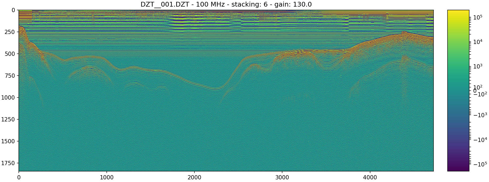

# readgssi v0.0.6-beta4



`readgssi` is a tool intended for use as an open-source translator and preprocessing module for subsurface data collected with GSSI ground-penetrating georadar (GPR) devices. It has the capability to read DZT and DZG files with the same pre-extension name and plot the data contained in those files. `readgssi` is currently able to translate most DZT files to CSV and will be able to translate to multiple other output formats including HDF5 and SEG-Y, though not all formats are available yet (see [future](#future)). Original Matlab code developed by Gabe Lewis, Dartmouth College Department of Earth Sciences. Python translation written with permission by Ian Nesbitt, University of Maine School of Earth and Climate Sciences.

Questions, feature requests, and bugs: **ian * nesbitt at gmail * com**

## changes since 0.0.5
- added support for the D50800 antenna
- added plotting support for dual-channel radar devices
  - merged #3 from @fxsimon which fixed a bug that caused multi-channel file traces to be read in a 121212 sequence instead of 111222
- updated the workings of the plotting algorithm's colormap
- changed the way files are saved (bug in 0.0.5 mangled some filenames)
- added the ability to specify colormap and whether to draw a colorbar and a histogram
- added an automatic figsize option (leaves figsize up to Matplotlib)
- added ability to apply gain
- fixed bug that caused gain to be applied incorrectly
- script now tries to automatically calculate timezero using (nsamp\*range)/position
#### known bugs:
- translation to anything but csv is broken (hope to have time for a fix soon)
  - csv translation does not work for dual-channel radar devices (exports to file but channels are merged end-to-end)
- color bar shows up too large on some plots (no known fix yet)

## usage
```
usage:
readgssi.py -i input.DZT [OPTIONS]

optional flags:
    COMMAND     |      ARGUMENT       |       FUNCTIONALITY
-v, --verbose   |                     |  verbosity
-o, --output    | file:  /dir/f.ext   |  specify an output file
-f, --format    | string, eg. "csv"   |  specify output format (csv is the only working format currently)
-p, --plot      | +integer or "auto"  |  plot will be x inches high (dpi=150), or "auto". default: 10
-c, --colormap  | string, eg. "Greys" |  specify the colormap ([https://matplotlib.org/users/colormaps.html#grayscale-conversion](https://matplotlib.org/users/colormaps.html#grayscale-conversion))
-g, --gain      | positive float      |  apply a gain value (gain > 1: greater contrast; 0 < gain < 1: less contrast. default: 1)
-b, --colorbar  |                     |  add a colorbar to the figure
-a, --antfreq   | positive integer    |  specify antenna frequency (read automatically if not given)
-s, --stack     | +integer or "auto"  |  specify trace stacking value or "auto" to autostack to ~2.5:1 x:y axis ratio
-m, --histogram |                     |  produce a histogram of data values
```

From a unix command line:
```
readgssi.py -i DZT__001.DZT
```
Simply specifying an input DZT file like in the above command (`-i file`) will display a host of data about the file including:
- name of GSSI control unit
- antenna model
- antenna frequency
- samples per trace
- bits per sample
- traces per second
- L1 dilectric
- sampling depth
- number of traces
- number of seconds

```
readgssi.py -i DZT__001.DZT -p 20 -s 6 -g 50
```
The above command will create and save a plot named "DZT__001.png" with a y-size of 20 inches (`-p 20`) and stack the x-axis to 6 times shorter than the original data array (`-s 6`). The script will apply a gain of 50 `-g 50`), meaning that contrast will be increased by a factor of 50.

```
readgssi.py -i DZT__001.DZT -p "auto" -s "auto" -g 0.5 -m
```
This will create the same plot but matplotlib will determine the y-axis size (`-p "auto"`) and the autostacking algorithm will stack the x-axis to approximately 2.5\*y for optimal display (`-s "auto"`). Data will be plotted with a gain value of 0.5, which means the plot contrast will be reduced by half (`-g 0.5`). The `-m` flag will draw a histogram for each data channel.

```
readgssi.py -i DZT__001.DZT -o test.csv -f CSV
```
Translates radar data to CSV format, which can be imported to, for example, `numpy` or `pandas` (or R, if that's your cup of tea).

## contributors
- Ian Nesbitt ([@iannesbitt](https://github.com/iannesbitt), author)
- [Gabe Lewis](https://earthsciences.dartmouth.edu/people/gabriel-lewis)
- Francois-Xavier Simon ([@fxsimon](https://github.com/fxsimon))
- Thomas Paulin ([@thomaspaulin](https://github.com/thomaspaulin))

## future
- GPS transcription (read from associated DZG file or CSV with mark name, lon, lat, elev, time)
- supplementing a flag indicating geophysical format (HDF5, SEGY, etc.) will write to that format
- calls to readgssi.readgssi(filename) from script or python shell will return np array and critical file statistics

## possible other future tools
- [irlib](https://github.com/njwilson23/irlib) integration (iir, timezero)
- usage of basic [obspy](https://github.com/obspy/obspy) filters?
