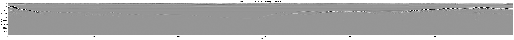
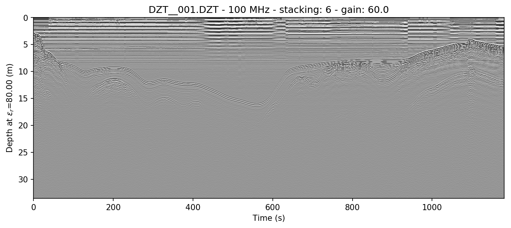
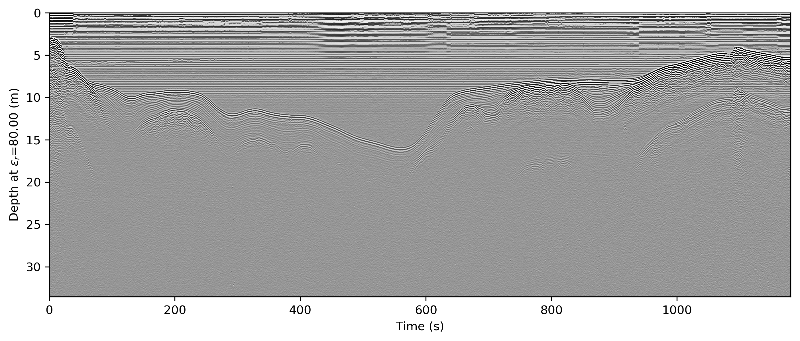
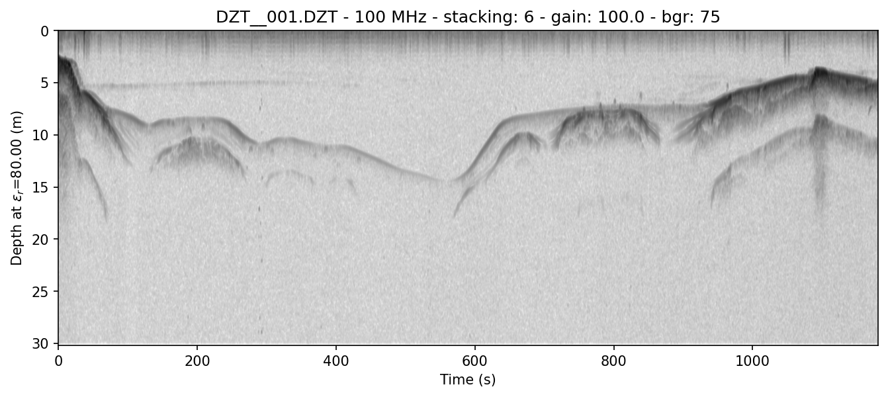

Plotting radargrams
#####################################

.. role:: bash(code)
   :language: bash

Plotting is often essential to data manipulation quality control. Here are some basic examples of plotting and plot rendering methods.

I give examples below, but you will quickly realize that a lot of radar data requires at least a little bit of a touchup before it looks presentable. That's covered in the next section, :doc:`processing`. Note that some of the examples below will jump ahead to use methods covered in that section.

.. note::
    I apologize to metric system users. matplotlib uses inches and dots per inch (DPI) and for consistency's sake I chose to adhere to imperial units for plot size :(

===========================
Basic plotting
===========================

Plotting with Python
---------------------------

Plotting in Python just means setting :code:`plot=7` or another integer, which represents the vertical size in inches. In this simple example, we use the :code:`zero=[233]` flag to get rid of the part of the radargram from before the direct wave meets the receiver.

.. code-block:: python

    from readgssi import readgssi
    readgssi.readgssi(infile='DZT__001.DZT', outfile='0a.png', frmt=None,
                      zero=[233], plotting=True, figsize=5)

Whoops! That's very long and not very helpful on a standard computer monitor. Let's pretend we've read :doc:`processing` and know how to stack arrays horizontally (see :ref:`Stacking`), and let's also add some gain to this image as well. (Jump to :ref:`Setting gain`)

Plotting with bash
---------------------------

Plotting on the command line is easy. The most basic plotting routine is accessible just by setting the -p flag and specifying a plot height in inches (:bash:`-p 5`). Here, we also use a zero of 233 samples (:bash:`-Z 233`).

.. code-block:: bash

    readgssi -i DZT__001.DZT -o 0a.png -Z 233 -p 5

Whoops! As you notice in the Python example above, this file is very long, which makes viewing tough on a screen (but may be what you want for figure creation).

`Back to top ↑ <#top>`_

================================
Setting gain
================================

Gain is added using the :code:`gain=int` setting. Let's set that to 60, since this is a lake profile and radar waves attenuate quickly in water. Here, Python and bash examples are given together.

.. note:: The gain parameter can also be set to a float value between 0 and 1 in order to reduce gain.

.. note:: This command sets the stacking parameter to "auto", which is explained in :ref:`Stacking`.

.. code-block:: python

    readgssi.readgssi(infile='DZT__001.DZT', outfile='0b.png', frmt=None,
                      zero=[233], plotting=True, figsize=5, stack='auto',
                      gain=60)

.. code-block:: bash

    readgssi -i DZT__001.DZT -o 0b.png -Z 233 -p 5 -s auto -g 60

Wow, looking much better! Now let's see if we can display depth units on the Z-axis.

`Back to top ↑ <#top>`_

================================
Changing axis units
================================

Z axis
--------------------------------

The Z axis can be displayed in three different unit types: samples, time, and distance. By default, it will display in nanoseconds (ns). The possible values for time display are "temporal", "time", "nanoseconds", and "ns". Setting the :code:`z` parameter to "samples" sets the axis to display the number of samples (cells) on that axis.

To set the Z-axis to display material depth, we use two separate flags: :code:`epsr=80` or :bash:`-E 80` --- which modifies the wave velocity by setting the dielectric to roughly that of water at 20 degrees C --- and :code:`z='m'` or :bash:`-z m`, which sets the z-axis to use those units to calculate profile depths. `"m"` stands for `meters`, but you can also specify "meters", "centimeters"/"cm", or "millimeters"/"mm" explicitly.

.. code-block:: python

    readgssi.readgssi(infile='DZT__001.DZT', outfile='0c.png', frmt=None,
                      zero=[233], plotting=True, figsize=5, stack='auto',
                      gain=60, epsr=80, z='m')

.. code-block:: bash

    readgssi -i DZT__001.DZT -o 0c.png -Z 233 -p 5 -s auto -g 60 -z m -E 80

If you would like to learn how to remove the horizontal noise in the water column of this image, head to :ref:`Getting rid of horizontal noise`.

X axis
-------------------------------

.. warning:: Changing the X-axis units is simple as well, but beware that distance units will not be accurate unless the file is either distance normalized, or was recorded with a survey wheel or DMI and has a proper samples per meter value set. See :ref:`Distance normalization` for more information.

The X axis can be displayed in time, traces, and distance. By default, it will display in seconds (s). To set this to "traces", which is calculated from the number of samples on the axis prior to stacking, set the :code:`x='traces'` or :bash:`-x traces` flag. See the warning above about setting the axis to distance.

`Back to top ↑ <#top>`_

================================
Making poster-quality figures
================================

Let's say you are really enamored with the way that last figure looks, and you now want to create a figure-quality image for a poster. You'll likely want to drop the title (:code:`title=False` in Python or :bash:`-T` in bash), and increase the DPI to something that will work well on a plotter (:code:`dpi=300` in Python or :bash:`-D 300` in bash). Pretty simple. Let's see it in action.

.. note:: Just for fun in this section (to show off figure creation), we're using two extra flags that will be explained fully in :ref:`Getting rid of horizontal noise`, as mentioned above.

.. note:: I use 300 DPI here to keep file size down, but if you are truly aiming for very high print quality (e.g. for a conference poster), you may want to increase to 600 DPI to match the capability of most high-end plotters.

.. code-block:: python

    readgssi.readgssi(infile='DZT__001.DZT', outfile='0d.png', frmt=None,
                      zero=[233], plotting=True, figsize=5, stack='auto',
                      gain=60, epsr=80, z='m', title=False, dpi=300,
                      freqmin=70, freqmax=130, bgr=True, win=75)

.. code-block:: bash

    readgssi -i DZT__001.DZT -o 0d.png -Z 233 -p 5 -s auto -g 60 -z m -E 80 -T -D 300 -r 75 -t 70-130

Output formats
--------------------------------

readgssi can output to any format supported by the underlying matplotlib base.
Usually, this means the following file formats:

.. literalinclude:: fileformats.txt

Say you'd like to output to the vector format SVG.
Many journals prefer this format because the vectors will allow them
to typeset the figure and the optimal resolution for both print and digital.
Let's take a look at how we do that.

.. code-block:: python

    readgssi.readgssi(infile='DZT__001.DZT', outfile='0d.svg', frmt='svg',
                      zero=[233], plotting=True, figsize=5, stack='auto',
                      gain=60, epsr=80, z='m', title=False, dpi=300,
                      freqmin=70, freqmax=130, bgr=True, win=75)

.. code-block:: bash

    readgssi -i DZT__001.DZT -o 0d.svg -f svg -Z 233 -p 5 -s auto -g 60 -z m -E 80 -T -D 300 -r 75 -t 70-130

The output file will look identical to the above figure, but will be in SVG format
(which not all browsers can handle, so no preview is given here).

`Back to top ↑ <#top>`_

================================
Changing the colormap
================================

By default, the colormap is Matplotlib's "gray", which is intended to emulate RADAN's default.

Changing colormaps is as simple as specifying a valid :class:`matplotlib.colors.Colormap` to use. For a list of valid colormaps, see the `Matplotlib documentation <https://matplotlib.org/users/colormaps.html#miscellaneous>`_. A popular alternative is "seismic", a diverging blue-white-red colormap used often in sub-bottom seismic surveying.

.. code-block:: python

    readgssi.readgssi(infile='DZT__001.DZT', outfile='0e.png', frmt=None,
                      zero=[233], plotting=True, figsize=5, stack='auto',
                      epsr=80, z='m', title=False, dpi=300, gain=60,
                      colormap='seismic',
                      freqmin=70, freqmax=130, bgr=True, win=75)

.. code-block:: bash

    readgssi -i DZT__001.DZT -o 0e.png -Z 233 -p 5 -s auto -g 60 -z m -E 80 -T -D 300 -r 75 -t 70-130 -c seismic

.. image:: _static/0e.png
    :width: 100%
    :alt: No plot title and figure-quality DPI

.. versionchanged:: 0.0.16
    The default colormap was changed to "gray", because of a previously unnoticed polarity switch in the previous default "Greys".

`Back to top ↑ <#top>`_

================================
Absolute value of gradient
================================

While we're on the topic of colormaps, it's worth pointing out that you can tell readgssi to calculate
the vertical derivative (the "gradient") of the profile and display its absolute value using the :code:`-A` flag.
This gradient display is a good way to highlight areas of polarity change regardless of positive or negative values.
It is particularly useful for highlighting glacial bed material through ice, for example.
Here (in a lake profile) we set both :code:`-A` (or :code:`absval=True` in Python) to plot the absolute value of vertical gradient
and the colormap to the reverse of the usual one (:code:`-c gray_r` in bash, :code:`colormap='gray_r'` in Python)
so that darker values indicate steeper gradient.

.. code-block:: python

    readgssi.readgssi(infile='DZT__001.DZT', outfile='0e.png', frmt=None,
                      zero=[233], plotting=True, figsize=5, stack='auto',
                      epsr=80, z='m', title=False, dpi=300, gain=100,
                      absval=True, colormap='gray_r',
                      freqmin=70, freqmax=130, bgr=True, win=75)

.. code-block:: bash

    readgssi -i DZT__001.DZT -o 0f.png -n -Z 233 -p 5 -s auto -g 100 -z m -E 80 -r 75 -t 70-130 -A -c gray_r

This presentation is absolutely critical in certain ice environments where electrical contrast is extremely low.
The conversion of each column into gradients rather than +-+ and -+- waves allows users to see where change is happening
fastest in each profile (i.e. where the gradient is the steepest--positive or negative).
This allows easier viewing of certain types of data where vertical change is difficult to differentiate,
such as surveys of cold, relatively uniform Antarctic blue ice.

===================================
Suppressing the Matplotlib window
===================================

By default, the matplotlib GUI window will display upon successful execution and saving of the radargram, so that you can modify titles and other plot features. To suppress this behavior, set the :code:`noshow=True` or :bash:`-n` option.

Because the program will wait for the closure of the Matplotlib window before continuing, this flag is useful for processing folders full of files in bash without user attention.

.. note::
    
    If plotting is on, readgssi will always save an image, regardless of whether or not the Matplotlib GUI is set to show up. I have found that this behavior makes it easier to save files under the same name but with title and axis label modifications.

    This is especially useful when the :code:`outfile` parameter is not set, and the program uses the :py:func:`readgssi.functions.naming` function to set complex but informative filenames. When saving from the Matplotlib window, click the save button, navigate to the file just saved by the program, then single-click the file name. The save dialog will auto-populate the filename and you can overwrite without the hassle of copying and pasting.

`Back to top ↑ <#top>`_
