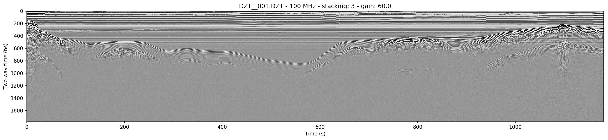
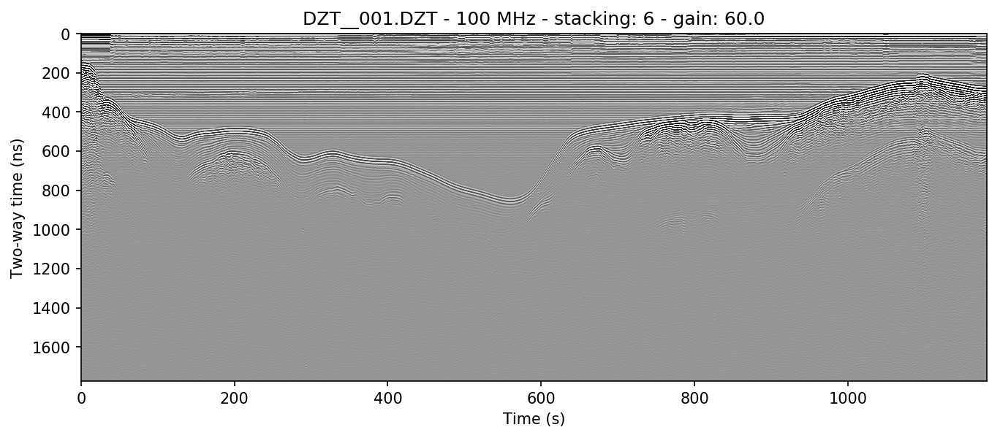
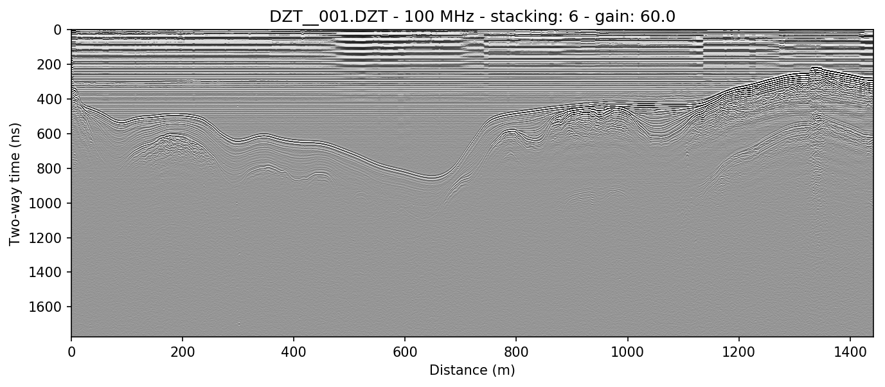
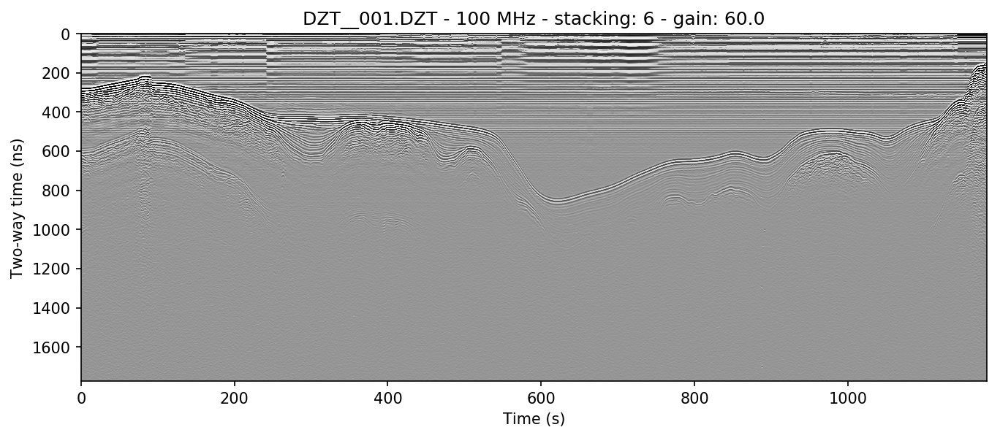

Processing radar arrays
#####################################

.. role:: bash(code)
   :language: bash

.. note:: This section covers some rudimentary (and some more complex) preprocessing methods. Note that these are only a few of the most common methods. If you would like to see another method added here, please `open a github issue <https://github.com/iannesbitt/readgssi/issues/new>`_ and briefly explain the method, preferably including the math involved.

===========================
Stacking
===========================

Stacking is the process of adding a number of successive neighboring trace columns together, both in order to reduce noise (by cancelling out random variation in neighboring cells) and to condense the X-axis of the radar array. This is very useful in lines with a high number of traces, as it both helps accentuate returns and make the long axis viewable on a reasonable amount of screen space.

The stacking algorithm is available in readgssi by using the :code:`stack=` argument in Python or the :bash:`-s` flag in bash. This program contains two methods of stacking: automatic and manual.

Autostacking
-------------------

The automatic stacking method checks the ratio of width to height and if it's above 2.5:1, sets the stacking parameter roughly equal to 2.5:1. This can reduce the hassle of trying a number of different stacking values like in RADAN. In Python, this is accessible via the :code:`stack='auto'` argument, while in bash, the flag is :bash:`-f auto`.

The file used in :ref:`Basic plotting` in the previous section shows the full length of the survey line. Below is the result of autostacking that line and turning the gain up (explained in :ref:`Setting gain`).

.. code-block:: python

    readgssi.readgssi(infile='DZT__001.DZT', outfile='1a.png', frmt=None,
                      zero=[233], plot=5, gain=60, stack='auto')

.. code-block:: bash

    readgssi -i DZT__001.DZT -o 1a.png -Z 233 -p 5 -g 60 -s auto

Stacking manually
--------------------------------------------------

Sometimes it is preferable to stack a plot a specific number of times determined by the user. Occasionally, you may want to create plots that are longer (have less stacking) or shorter (have more stacking) than the auto method. The example above is stacked 6 times, here we will stack half that amount (i.e. the X-axis will be longer). In python: :code:`stack=3`; in bash: :bash:`-s 3`.

.. code-block:: python

    readgssi.readgssi(infile='DZT__001.DZT', outfile='1b.png', frmt=None,
                      zero=[233], plot=5, gain=60, stack=3)

.. code-block:: bash

    readgssi -i DZT__001.DZT -o 1b.png -Z 233 -p 5 -g 60 -s 3

`Back to top ↑ <#top>`_

=================================
Getting rid of horizontal noise
=================================

Horizontal average filters (BGR)
----------------------------------

Horizontal average filters, also known as background removal or BGR, are commonly used to remove both low-frequency skew and higher frequency horizontal reverberation banding that can occur in some survey environments. In this program there are two types of BGR: full-width average and moving window average. The former resembles RADAN's simplest BGR algorithm, while the latter emulates its BOXCAR style filter.

Full-width
^^^^^^^^^^^^^^^^^^^^^^^^^^^^^^^^^^^^

The full-width BGR filter in readgssi simply takes the average of each row in the array and subtracts that value from the row values themselves, essentially moving their mean value to zero. This can work well in some environments but can cause additional horizontal banding if strongly reflective layers are horizontal for many consecutive traces.

.. code-block:: python

    readgssi.readgssi(infile='DZT__001.DZT', outfile='2a.png', frmt=None,
                      zero=[233], plot=5, stack='auto', gain=60,
                      bgr=0)

.. code-block:: bash

    readgssi -i DZT__001.DZT -o 2a.png -Z 233 -p 5 -s auto -g 60 -r 0

Boxcar/moving window
^^^^^^^^^^^^^^^^^^^^^^^^^^^^^^^^^^^^

The boxcar-style method is preferred by many because although it has a tendancy to wipe out data that's too strongly horizontal, it also removes more noise from areas of weak returns and can help make the profile look cleaner. The side effect of this is that it causes artificial wisps on either side of non-horizontal objects, about the size of half the window, and that it can wipe out horizontal layers that are longer than the window length. If you find that it turns horizontal layers into indistinguishable mush, increase the window size and try again.

.. code-block:: python

    readgssi.readgssi(infile='DZT__001.DZT', outfile='2b.png', frmt=None,
                      zero=[233], plot=5, stack='auto', gain=60,
                      bgr=100)

.. code-block:: bash

    readgssi -i DZT__001.DZT -o 2b.png -Z 233 -p 5 -s auto -g 60 -r 100

Frequency filter (vertical triangular bandpass)
-------------------------------------------------

The vertical filter is more sophisticated and requires proper identification of the antenna's center frequency. Because antennas emit bands of frequencies centered around the manufacturer's specified center frequency, data will often lie within those frequencies. However, noise at other frequency bands is sometimes picked up, whether due to the dielectric of the first layer, or external sources. Often it will be necessary to let pass only the frequencies around the center frequency. 

For a 100 MHz antenna, this band can be as wide as 70-130 MHz at low dielectric values. Open water profiles are often much cleaner after being filtered approximately 80% as high as those in higher dielectric media, approximately 70-130 MHz.

.. code-block:: python

    readgssi.readgssi(infile='DZT__001.DZT', outfile='2c.png', frmt=None,
                      zero=[233], plot=5, stack='auto', gain=60,
                      freqmin=60, freqmax=100)

.. code-block:: bash

    readgssi -i DZT__001.DZT -o 2c.png -Z 233 -p 5 -s auto -g 60 -t 70-130

Combining filters
-------------------------------

It's typically worthwhile to play with combining filters, as often they can have a compounding effect on cleaning up the profile. See for example what the application of both the horizontal moving window and the vertical triangular filter can do to make the water column of this lake profile look clean enough to see thermoclines:

.. code-block:: python

    readgssi.readgssi(infile='DZT__001.DZT', outfile='2c.png', frmt=None,
                      zero=[233], plot=5, stack='auto', gain=60, dpi=300,
                      bgr=100, freqmin=60, freqmax=100)

.. code-block:: bash

    readgssi -i DZT__001.DZT -o 2c.png -Z 233 -p 5 -s auto -g 60 -D 300 -r 100 -t 70-130

`Back to top ↑ <#top>`_

===========================
Distance normalization
===========================

If your files are recorded as time-triggered such as in the case of this lake profile, they need to be distance-normalized before they can be rendered with distance on the X-axis. This can only be done if there is proper GPS information in DZG format.

The relevant function is :py:mod:`readgssi.arrayops.distance_normalize`, accessible with :code:`normalize=True` or :bash:`-N`, which calculates the distance traveled between GPS marks and resamples the array to a normalized state, then calculates the new samples per meter value and applies that to the header. The resulting corrected array can be displayed in distance units with :code:`x='m'` or :bash:`-x m`.

.. warning:: Do not use :code:`x='m'` or :bash:`-x m` without either a DMI or distance normalization, as the file header samples per meter value could be very wrong (and in some cases will surely be wrong due to how RADAN handles distance, which has known flaws).

.. note:: Recording GPS information with a GSSI system that does not have GPS input is not recommended. However, GPS marks can be aligned with user marks in GSSI files if the user can record GPS and radar mark information at the same time every set number of meters traveled. GPX (GPS exchange format) files with identical marks to GSSI files can be cross-correlated to DZG by using the `gpx2dzg <https://github.com/iannesbitt/gpx2dzg>`_ software package.

This example distance normalizes and displays the X-axis in meters. Note the change in the beginning of the line, in which the slope appears longer than it really is due to slower survey speed at the start of the line.

.. code-block:: python

    readgssi.readgssi(infile='DZT__001.DZT', outfile='2c.png', frmt=None,
                      zero=[233], plot=5, stack='auto', gain=60,
                      normalize=True, x='m')

.. code-block:: bash

    readgssi -i DZT__001.DZT -o 3a.png -Z 233 -p 5 -s auto -g 60 -N -x m

X axis distance units
------------------------

The X-axis can be modified to display various distance units. These include: kilometers/km, meters/m, and centimeters/cm. To use these, set :code:`x='km'` / :bash:`-x km`, :code:`x='m'` / :bash:`-x m`, or :code:`x='cm'` / :bash:`-x cm`.

See warning above for caveats about using distance units.

Pause correction
------------------------

The way SIR-4000 units handle pauses while ingesting NMEA GPS data is broken. Typically while recording with GPS input,
SIR units write out a DZG file, with :code:`GSSIS` strings that keep track of the corresponding trace numbers for each
NMEA GPS sentence received. However if the line recording is paused, the DZG file continues to record NMEA strings.
This results in an offset between the trace number recorded in the DZG and the trace number in the GPS array.
So for example, if your GPS is sending NMEA strings at 1 Hz, and you pause for 10 seconds, your DZG file will record
10 more traces than actually exist in the DZT. This causes problems when distance normalizing, since the trace numbers
in the DZG are misaligned, and distance normalization relies on those trace numbers to adjust the array.

:py:mod:`readgssi.gps.pause_correct` can correct these offsets prior to distance normalization.
First, the original DZG file is backed up to a .DZG.bak file for data safety. If the function detects that this file
already exists, then it will use the data from that file for the pause correction. This is to ensure that data always
remains both backed up and that a corrected working .DZG file is maintained.

The function works by calculating when GPS velocity drops below a certain value (default of 0.25 m/s) for more than 3
GPS epochs (excluding the start and end of the survey line). Where this occurs, the function will subtract the number
of "paused" epochs from subsequent :code:`GSSIS` trace numbers in the DZG file.

Additionally, all corrected GPS epochs will be written to a CSV file for easy integration into a GIS environment.

The function can be implemented using the :code:`-P` flag in command line usage alongside distance normalization.

`Back to top ↑ <#top>`_

===========================
Reversing
===========================

Sometimes it is necessary to reverse the travel direction of a survey line in order to show a comparison with a line that travels in the opposite direction. readgssi will read arrays backwards if :code:`reverse=True` or :bash:`-R` are set, using the :py:func:`readgssi.arrayops.flip` function.

.. code-block:: python

    readgssi.readgssi(infile='DZT__001.DZT', outfile='4a.png', frmt=None,
                      zero=[233], plot=5, stack='auto', gain=60,
                      reverse=True)

.. code-block:: bash

    readgssi -i DZT__001.DZT -o 4a.png -Z 233 -p 5 -s auto -g 60 -R

`Back to top ↑ <#top>`_
