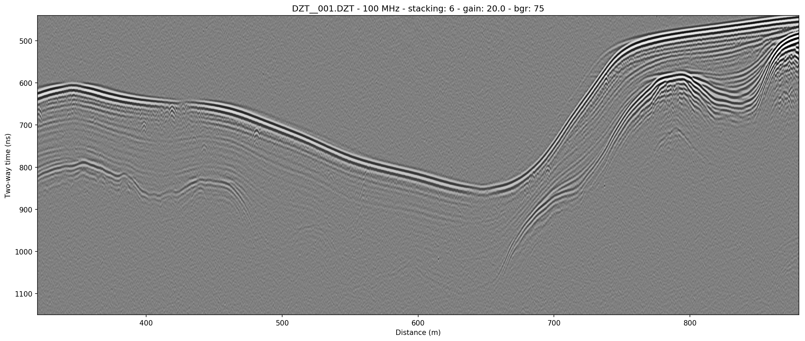

# Summary

 The demands of ice- and ground-penetrating radar (GPR) surveying, as in many types of scientific fieldwork, require that both quality control and time savings are critical to a successful field campaign. This software provides a way to quickly read, process, and display radar data produced by Geophysical Survey Systems Incorporated (GSSI) radar antennas and control units. GSSI's own RADAN software is bulky, closed-source, non-free, and not meant to handle folders full of GPR data files at once. `readgssi` was designed to be used in the field to quality-check entire folders of data files by converting radar profiles to portable network graphics (PNG) images, saving users valuable time versus performing the equivalent actions by hand in RADAN, especially in the case of projects with large file counts.

 `readgssi` contains functions to filter, stack, and distance-normalize radar data, and enhance gain of radargrams in similar manner to the equivalent functionality in RADAN. `readgssi` can be used from the command line and thus is scriptable in both Unix and Python environments, and can also be used as a translation tool to extract data as numpy arrays or save as text files.

 A pre-release version of `readgssi` has been used to quality-check radar data during field campaigns by the author and other geophysics students and faculty at the University of Maine and Colby College. The software has also been used to create presentation-quality radargram figures for conference publications [@Nesbitt:2018; @Nesbitt:2019]. The source code for `readgssi` is available on GitHub (https://github.com/iannesbitt/readgssi/) and has been archived to Zenodo (doi:[10.5281/zenodo.1439119](https://dx.doi.org/10.5281/zenodo.1439119)).

# Acknowledgements

I am grateful for code contributions from François-Xavier Simon and Thomas Paulin, and for support from Gabe Lewis. I am especially indebted to the support team at GSSI for the graciousness they showed in providing file format documentation, without which this project could not have moved forward.

# References
